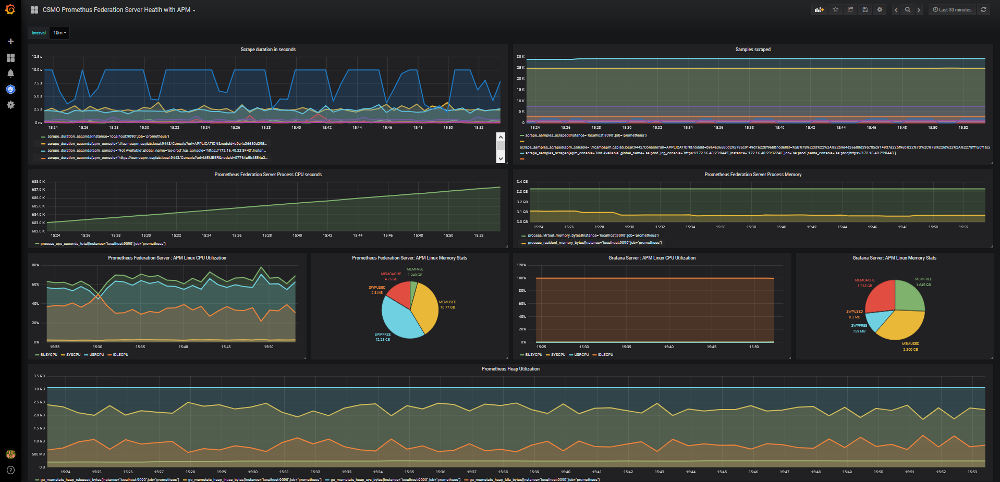
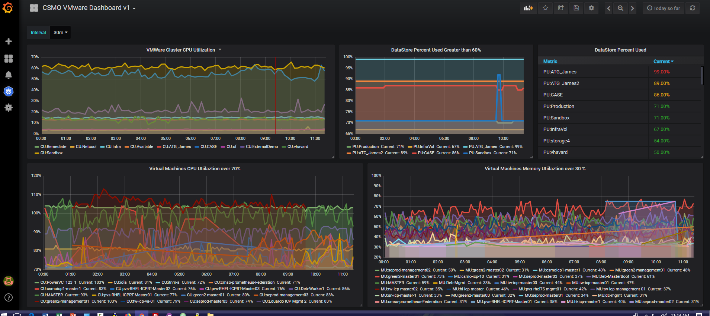

# CSMO Expert Labs APM
In addition to monitoring an ICP deployment or any application, most enterprises have at least one or more APM tools deployment in their environment.
CSMO EL used the IBM APM tool for monitoring ICP, application installed in ICP and other components such as VMware. Currently Version 8.1.4 is installed. We also leverage the [APM Grafana plugin](https://github.com/rafal-szypulka/grafana-ibm-apm) to provide APM and ICP observability in Grafana.  

More information anout the IBM APM solution for ICP is here [IBMAPM](https://developer.ibm.com/apm/docs/apm-and-ibm-cloud-monitoring/)

We Monitor the ICP Host Linux OS with the os-agent. This is a view of ICP OS monitoring

We monitor with the VMware infrastructure with the APM v8 agents

vmaware PIC

We monitor URLs and generate transactions, using Selenium Scripts and URL/API monitors. The scripts are run via both the Synthetic Transaction agent in APM and via IBM Clouds Availability Monitoring in IBM Cloud Public.

Synthetics PIC

All of the monitoring tools report any alerts to our Netcool Operations Insight deployment for processing and notification.  

Grafana has been used to create dashboards using both the Federation Prometheus Server and Data stored in APM. The Screen Shot below is a dashboard showing scrape performance on the Federation Server along with CPU and Memory consumption delivered via the APM OS Agent.

Also with Grafana we have established a view of our VMware environment

