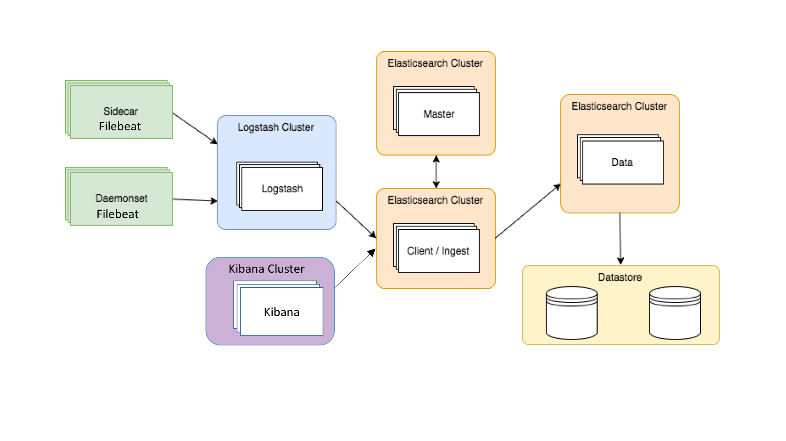
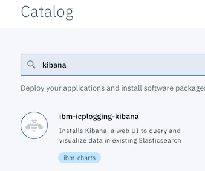
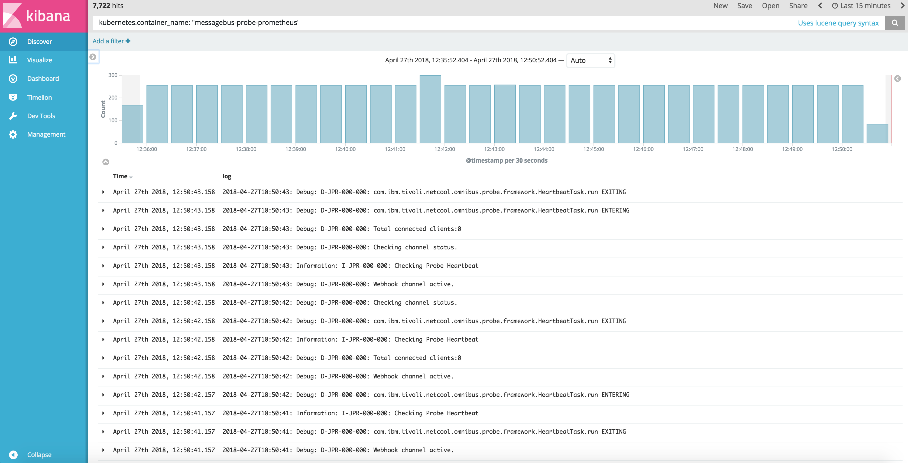
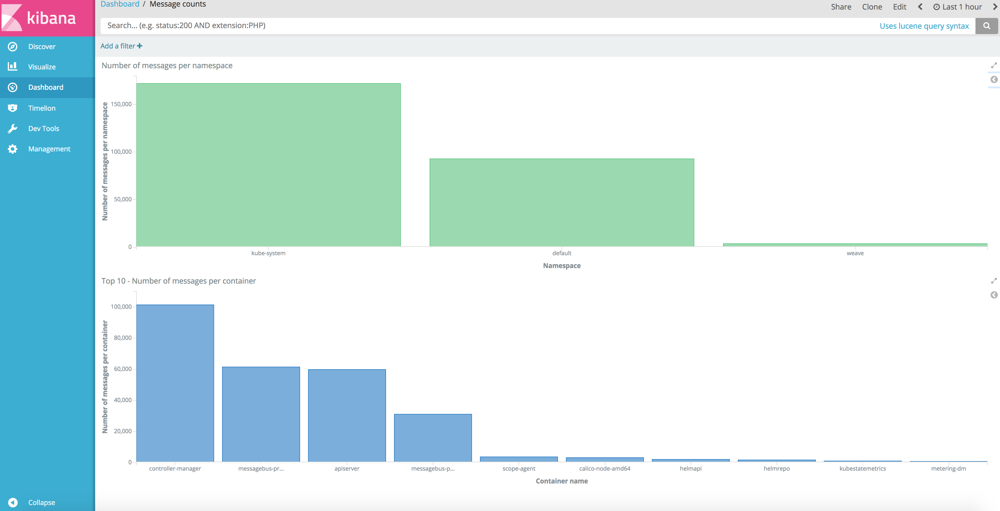

- [Introduction](#introduction)
- [Basic logging in Kubernetes](#basic-logging-in-kubernetes)
- [Cluster level logging in IBM Cloud Private](#cluster-level-logging-in-ibm-cloud-private)
	- [Filebeat](#filebeat)
	- [Logstash](#logstash)
	- [Kibana](#kibana)
	- [Installation of ELK in IBM Cloud Private](#installation-of-elk-in-ibm-cloud-private)
		- [Kibana installation](#kibana-installation)
	- [Configuration settings](#configuration-settings)
		- [Log data storage and retention](#log-data-storage-and-retention)
		- [Logstash configuration](#logstash-configuration)
	- [Using Kibana for log search and visualization](#using-kibana-for-log-search-and-visualization)
- [Collecting additional logs from worker nodes](#collecting-additional-logs-from-worker-nodes)
- [CSMO logging solution for ICP Cloud Foundry](ICP-Logging-CloudFoundry)
- [Further reading](#further-reading)

# Introduction
Application and systems logs can help you understand what is happening inside your ICP cluster. The logs are particularly useful for debugging problems and monitoring cluster activity. The easiest and most embraced logging method for containerized applications is to write to the standard output and standard error streams.

However, the native functionality provided by a container engine or runtime is usually not enough for a complete logging solution. For example, if a container crashes, a pod is evicted, or a node dies, usually you will still want to access your application’s logs. As such, logs should have a separate storage location, and lifecycle that is independent of nodes, pods, or containers. This concept is called cluster-level-logging. Cluster-level logging requires a separate backend to store, analyze, and query logs. IBM Cloud Private provides a logging solution based on ELK stack.

ELK is an abbreviation for three products - [Elasticsearch](https://www.elastic.co/products/elasticsearch), [Logstash](https://www.elastic.co/products/logstash), and [Kibana](https://www.elastic.co/products/kibana), that are built by [Elastic](http://elastic.co) and together comprise a stack of tools that can be used to stream, store, search, and monitor logs. [Filebeat](https://www.elastic.co/products/beats/filebeat) is another ICP logging solution component, also provided by Elastic. Filebeat is responsible for collecting log data. The ELK stack that is provided with IBM Cloud Private uses the official ELK stack images that are published by Elastic. While an ELK stack is provided by default, you can use another logging solution.

# Basic logging in Kubernetes

Kubernetes always stores the standard output and standard error output of each container. You simply need to run the command `kubectl logs`  to reach all the logs of the desired container.

```
Examples:
  # Return snapshot logs from pod nginx with only one container
  kubectl logs nginx

  # Return snapshot logs for the pods defined by label app=nginx
  kubectl logs -lapp=nginx

  # Return snapshot of previous terminated ruby container logs from pod web-1
  kubectl logs -p -c ruby web-1

  # Begin streaming the logs of the ruby container in pod web-1
  kubectl logs -f -c ruby web-1

  # Display only the most recent 20 lines of output in pod nginx
  kubectl logs --tail=20 nginx

  # Show all logs from pod nginx written in the last hour
  kubectl logs --since=1h nginx

  # Return snapshot logs from first container of a job named hello
  kubectl logs job/hello

  # Return snapshot logs from container nginx-1 of a deployment named nginx
  kubectl logs deployment/nginx -c nginx-1
```

The attribute `--previous` is available to reach the logs of a crashed instance, and this might be sufficient for minor clusters, with a small number of running containers and instances. However, it becomes very hard to manage cluster logs when the number of applications increases and the cluster runs on several machines. 

# Cluster level logging in IBM Cloud Private

The diagram below shows the basic architecture of logging components in IBM Cloud Private.



## Filebeat
[Filebeat](https://www.elastic.co/products/beats/filebeat) is a component responsible for collecting log data and sending to Logstash. Filebeat Pod is configured as a Daemonset – a K8S controller object which ensures that all (or some) Nodes run a copy of a Filebeat Pod. Every pod in a K8S cluster has its standard output and standard error captured and stored in the /var/log/containers/ node directory. A Filebeat could therefore be described as a DaemonSet pod that captures the logs provided in each node’s `/var/log/containers/` directory, does initial processing and sends to Logstash cluster.
Filebeat Deamonset is installed by default with ICP.

```
$ kubectl get ds -n kube-system|grep filebeat
filebeat-ds-amd64                            3         3         3         3            3           beta.kubernetes.io/arch=amd64                     26d
filebeat-ds-ppc64le                          0         0         0         0            0           beta.kubernetes.io/arch=ppc64le                   26d
filebeat-ds-s390x                            0         0         0         0            0           beta.kubernetes.io/arch=s390x                     26d
```
For example on a ICP cluster with three nodes we should see three Filebeat Pods:

```
$ kubectl get pod -n kube-system|grep filebeat
filebeat-ds-amd64-7tk66                                   1/1       Running   0          29d
filebeat-ds-amd64-qjmvq                                   1/1       Running   0          29d
filebeat-ds-amd64-xprcs                                   1/1       Running   0          29d
```

Another method of configuring Filebeat for container log data collection is configuring Filebeat container as a sidecar container in a particular pod we want to collect logs from. This method is useful for containerised applications that don’t stream logs to STDOUT or STDERR, but store it in the log files located in directories like `/var/log`. Application container needs be configured to share log directory with the sidecar Filebeat container, so it can access the logs without any furter modification of the containerized application. Instructions how to build a sidecar Filebeat container can be found in ICP [documentation](https://www.ibm.com/support/knowledgecenter/SSBS6K_2.1.0.2/manage_metrics/logging_elk.html).

## Logstash
Logstash is an open source, data processing pipeline that ingests data from a multitude of sources simultaneously, transforms it, and then sends to defined output like indexing engine.

In case of default ICP logging configuration, it receives data from Filebeat instances, transforms it and send to Elasticsearch.
Single Logstash pod can be scaled out if needed. The default, single-instance Logstash configuration can handle hundreds of log entries per second, with CPU usage that grows at a rate of about one core per 150 - 200 records per second.
A single Logstash instance is installed with ICP by default.

```
$kubectl get deployment -n kube-system|grep logstash
logstash                                 1         1         1            1           29d
```


## Elasticsearch
[Elasticsearch](https://www.elastic.co/products/elasticsearch) is a search engine based on Apache Lucene. It provides a distributed, multitenant-capable, full-text search engine with an HTTP web interface and schema-free JSON documents.
The following Elascicsearch instances are installed with IBM Cloud Private by default:

- Elasticsearch master node which coordinates the management of the Elasticsearch cluster
- Elasticsearch client node that implements the interface for all incoming logs from Logstash and queries from Kibana
- Elasticsearch data node to process and store all of the log data

Elasticsearch master and client pods are controlled by Deployment controller:

```
$ kubectl get deployment -n kube-system|grep elastic
elasticsearch-client                     1         1         1            1           29d
elasticsearch-master                     1         1         1            1           29d
```

Elasticsearch data pod is managed by [StatefulSet](https://kubernetes.io/docs/concepts/workloads/controllers/statefulset/) controller:

```
$ kubectl get statefulsets -n kube-system|grep elastic
elasticsearch-data   1         1         29d
```

## Kibana
[Kibana](ttps://www.elastic.co/products/kibana) is an open source analytics and visualization platform designed to work with Elasticsearch. It can be used to search, view, and interact with data stored in Elasticsearch indices. Kibana can be optionally installed during ICP installation or deployed after the installtion. Details in the [installation](#installation-of-elk-in-ibm-cloud-private) section.

## Installation of ELK in IBM Cloud Private
Default installation of IBM Cloud Private deploys single Filebeat instance per worker node, single Logstash instance and set of Elasticsearch instances as described in the [Elasticsearch](#elasticsearch) section.
Similar set of logging componets can be deployed any time using `icp-logging` helm chart. Kibana is and option during [ICP installation](https://www.ibm.com/support/knowledgecenter/SSBS6K_2.1.0.2/installing/config_yaml.html). It can be deployed during ICP installation, if you set `kibana_install` to `true` (default setting is `false`) in the `config.yaml`. If it wasn't deployed during ICP installation, it can be easily installed using `icp-logging-kibana` helm chart.

### Kibana installation
If Kibana was not already installed with ICP, deploy `ibm-icplogging-kibana` helm chart.

- Logon to ICP console
- Access helm charts repository Catalog -> Helm Charts and select `ibm-icplogging-kibana`



- Click `Configure` button, specify `Release name`, `Target namespace` and select license agreement checkbox. Other, predefined options can be changed if needed.
- Click `Install`, to deploy helm chart.


## Configuration settings

### Log data storage and retention

The ELK stack that is installed by default in IBM Cloud Private includes a **curator**, an ELK component that removes data that is older than a specified age. Elasticsearch splits stored data into chunks, called indices. The curator deletes indices that are older than the age that you specify. It's deployed as a separate pod, and, by default, runs every night at 24:00 to removing indices that are older than one day. It is not recommended to change this setting without increasing default Elasticsearch PersistentVolume size, which is 20 GB.
**Curator** settings are stored in the `es-curator` ConfigMap. Edit it using the following command:

```
kubectl edit cm es-curator -n kube-system
```


### Logstash configuration
Default Logstash configuration is stored in the `logstash-pipeline` ConfigMap.
The following fields are extracted by default in Logstash and thus available in Kibana search and dasboards:

- **kubernetes.container_id**: A unique identifier that is generated by Docker for each container.
- **kubernetes.container_name**: The readable name for a container that Kubernetes uses.
- **kubernetes.pod**: The name of the pod in which a container is deployed. The values of this field usually correspond to the pods that are listed if you run the kubectl get pods command.
- **kubernetes.namespace**: The namespace into which the associated pod deploys.

If you want to learn how these fields are extracted from log steam or develop custom Logstash configuration, edit the `logstash-pipeline` ConfigMap:

```
kubectl edit cm logstash-pipeline -n kube-system
```

## Using Kibana for log search and visualization

After you initially configure Kibana, users can open the Discover tab to search and analyze log data.
The following example shows log search results for the query:

```
kubernetes_container_name: "messagebus_probe_prometheus"
```

which returns all log entries coming from the `messagebus_probe_prometheus` container.



Fields extracted in Logstash are available in a Kibana search queries and dashboard panel. By using these fields, you can use Kibana to monitor or analyze the logs for both small and large scopes. The scope can be as narrow as the container itself or as broad as every pod in the namespace.

In the following example, the field **kubernetes.namespace** was used to render a graph with number of log entries per namesapce. The second graph, displaying the top 10 most active containers in terms of number of log messages, is based on the **kubernetes.container_name** field.

[Import](https://www.elastic.co/guide/en/kibana/5.0/loading-a-saved-dashboard.html) attached Kibana [visualizations](Kibana-example-visualizations.json) and [dashboard](Kibana-example-dashboard.json) to learn how to build Kibana dashboards.



# Collecting additional logs from worker nodes

The example below shows how to configure collection of  `/var/log/syslog` log from ICP worker nodes running on Ubuntu into ICP ELK.

Edit the filebeat configmap to add a new input_type:

```
kubectl edit cm logging-elk-filebeat-ds-config -n kube-system
```

Add another `input_type` entry like the following:

```
    - input_type: log
      paths:
        - /var/log/syslog
      scan_frequency: 10s
      fields_under_root: true
      fields:
        type: syslogs
        node.hostname: ${NODE_HOSTNAME}
```

Edit filebeat daemonset to add `/var/log/syslog` as a volume:

```
kubectl edit ds logging-elk-filebeat-ds -n kube-system
```

add the following section in the `volumeMounts:`

```
   - mountPath: /var/log/syslog
     name: syslog
     readOnly: true
```     
and the following section in the `volumes:`

```     
   - hostPath:
     path: /var/log/syslog
     type: ""
     name: syslog
``` 

After a couple of minutes verify in Kibana with search string: `type: syslogs`

# Further Reading
* [How to configure Kubernetes audit log in IBM Cloud Private](https://medium.com/@epatro/how-to-configure-kubernetes-audit-log-in-ibm-cloud-private-22d237ddc071)
* [Processing Logs with IBM Cloud Private and Cloud Automation Manager](https://developer.ibm.com/cloudautomation/tutorials/processing-logs-cloud-automation-manager/)
* [Forwarding logs from ICP ELK to Splunk \(IBM internal\)]
(https://apps.na.collabserv.com/blogs/c83b42e5-2186-42f1-b498-2871621e2984/entry/ICP_Forwarding_events_from_Logstash_to_Splunk?lang=en_us)

