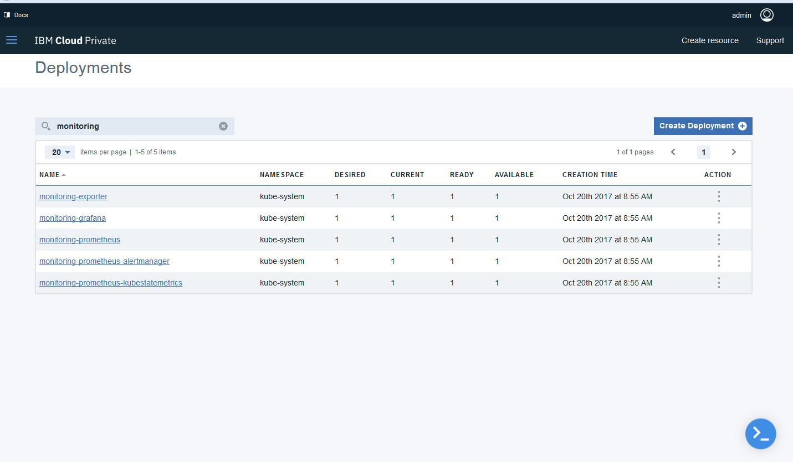

**Prometheus**

***Base documentation for Prometheus Monitoring***

[Basic documentation can be found in the ICP Knowledge center](https://www.ibm.com/support/knowledgecenter/SSBS6K_2.1.0/manage_metrics/monitoring_service.html)

***Further generic information***

Prometheus is a systems and service monitoring system. It collects metrics from configured targets at given intervals, evaluates rule expressions, displays the results, and can trigger alerts if some condition is observed to be true. 
https://prometheus.io/
Both Prometheus and Kubernetes are developed under the Cloud Native Computing Foundation (CNCF) project.

Prometheus has several components for the collection of Time Series Data, an Alert Manager and a central Prometheus Server which scrapes  and stores the data. The data is visualized using a Grafana instance.

The Prometheus and Grafana stacks are deployed by default when ICP is installed, unless the value of **disabled_management_services** is changed from default in [config.yaml](https://www.ibm.com/support/knowledgecenter/SSBS6K_2.1.0/installing/config_yaml.html)
If you've configured ICP to use a [management node](https://www.ibm.com/support/knowledgecenter/SSBS6K_2.1.0/installing/hosts.html) then the stack will be deployed on that node. Otherwise they will co-exist with the rest of the workloads.

Within the ICP GUI, you can see the Prometheus/Grafana Deployments, Services and ConfigMaps by selecting **main menu**->**Platform** and then the component type you are interested in.
Filter by *monitoring* (and *alert* too in the case of ConfigMaps) to see the components that are dedicated to monitoring ICP.



You can also see the components using the command line interface:

```
$kubectl get configmap --namespace=kube-system | grep "alert\|monitor"
alert-rules                           1         6d
alertmanager-router-nginx-config      1         6d
monitoring-grafana-config             1         6d
monitoring-grafana-dashboard-config   3         6d
monitoring-prometheus                 1         6d
monitoring-prometheus-alertmanager    1         6d
monitoring-router-entry-config        1         6d
```


***Creating alerts in Prometheus***
In order to generate alerts and notify people that an incident has occured, two items must be configured in Prometheus
1. The notification targets (i.e. who do we want to inform) and
2. The rules (i.e. what do we want to inform them of)

Definition of notification targets is explained in the [Integration](https://github.com/ibm-cloud-architecture/CSMO-ICP/tree/master/integration) section.
Basic documentation on the creation of Prometheus rules can be found in the [Prometheus documentation](https://prometheus.io/docs/alerting/rules/).


